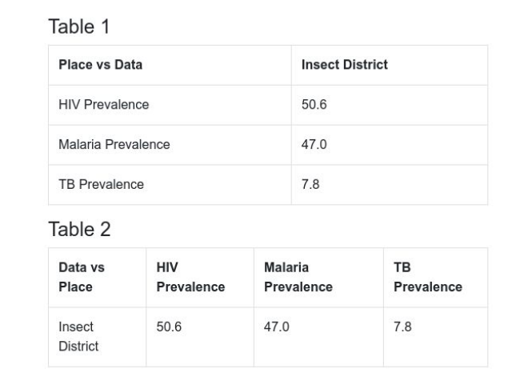

# HISP Teaser Project
Date: 27th October 2020

Author: Gift A. Nnko

## Introduction

This is a teaser project provided by HISP Tanzania as an interview.
Task: 

`Develop a simple web page that displays the above-provided JSON data into
table formats, See below​ . ​ Strictly, write a dynamic javascript function
that takes in the provided JSON as its input and generates output possible
for drawing a table. The same function should be able to produce the
output for both table arrangements below. You may provide additional input
to the function to help you handle table arrangements.`

JSON Provided:

```
{
  "headers": [
    {
      "id": "dx",
      "name": "Data"
    },
    {
      "id": "ou",
      "name": "Place"
    },
    {
      "id": "value",
      "name": "Value"
    }
  ],
  "metaData": {
    "names": {
      "hTUspcBc4Yn": "HIV Prevalence",
      "EzE8xZ31zfC": "Malaria Prevalence",
      "E31SemmmFGb": "TB Prevalence",
      "dx": "Data",
      "ou": "Place",
      "R7TPl8q81Ft": "Insect District"
    },
    "dimensions": {
      "dx": ["EzE8xZ31zfC", "hTUspcBc4Yn", "E31SemmmFGb"],
      "ou": ["R7TPl8q81Ft"]
    }
  },
  "rows": [
    ["EzE8xZ31zfC", "R7TPl8q81Ft", "47.0"],
    ["hTUspcBc4Yn", "R7TPl8q81Ft", "50.6"],
    ["E31SemmmFGb", "R7TPl8q81Ft", "7.8"]
  ]
}

```
Table Structures:




## Requirements
`- Node Js`

`- Yarn`

## Setup
To setup the project run

`yarn`


## How to run
To run the project run
### `yarn start`

Runs the app in the development mode.\
Open [http://localhost:3000](http://localhost:3000) to view it in the browser.

To view the running application click [here](https://gian2705.github.io/hisp_teaser)
